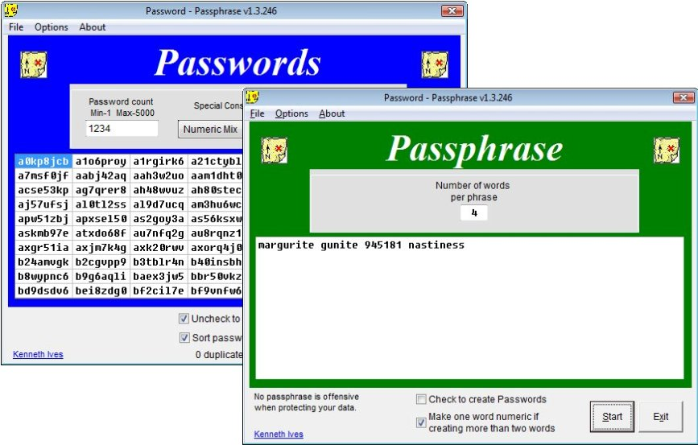



## Passwords and Phrases  02\-May\-2012

### Description

Create passwords (up to 5000 at a time) and pass phrases (one to twenty-five words). Be sure to read Form_problems.pdf if you encounter any display quirks. Well documented.

=== 02-May-2012 Updated clsRandom module.
 
### More Info
 

             |
---                |---
**Submitted On**   |2012-05-02 15:07:44
**By**             |[Kenaso](https://github.com/Planet-Source-Code/PSCIndex/blob/master/ByAuthor/kenaso.md)
**Level**          |Intermediate
**User Rating**    |5.0 (15 globes from 3 users)
**Compatibility**  |VB 6\.0
**Category**       |[Complete Applications](https://github.com/Planet-Source-Code/PSCIndex/blob/master/ByCategory/complete-applications__1-27.md)
**World**          |[Visual Basic](https://github.com/Planet-Source-Code/PSCIndex/blob/master/ByWorld/visual-basic.md)
**Archive File**   |[Passwords\_222330522012\.zip](https://github.com/Planet-Source-Code/kenaso-passwords-and-phrases-02-may-2012__1-73511/archive/master.zip)

